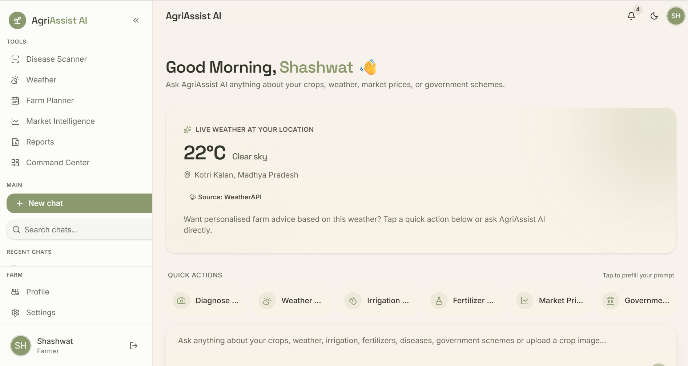
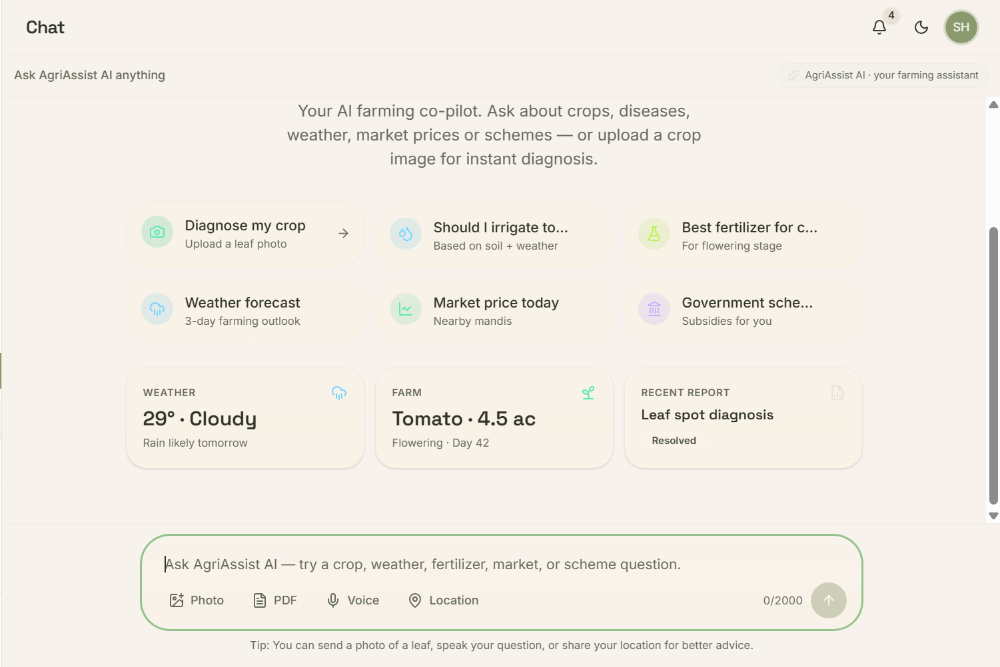
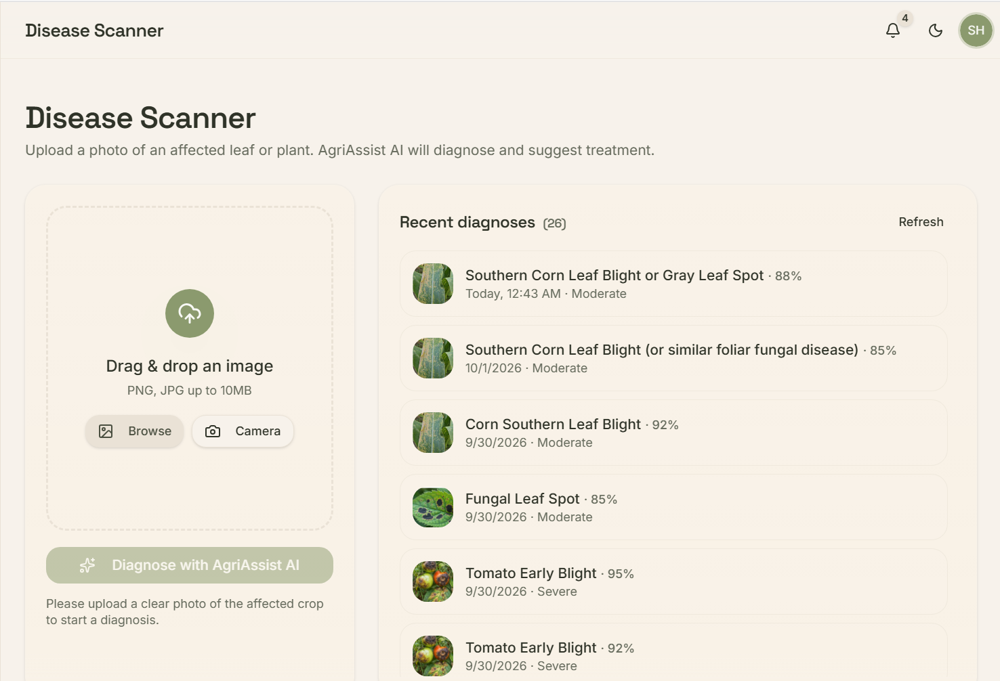
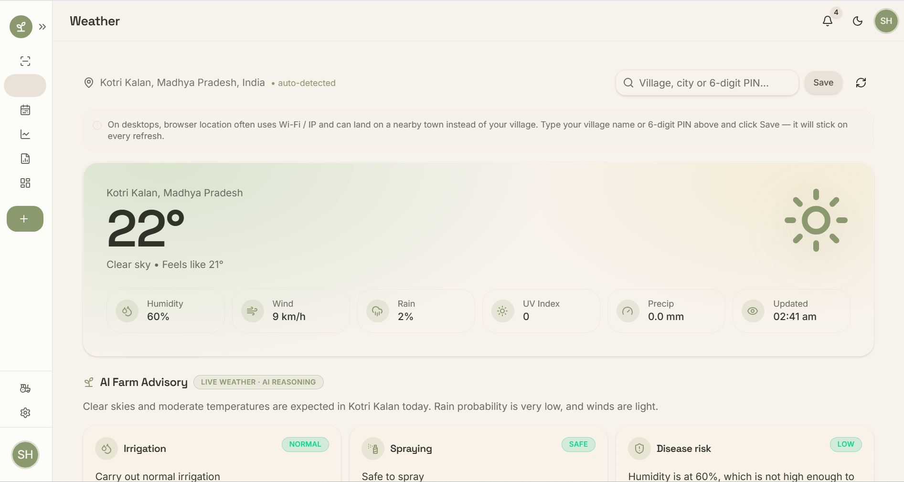
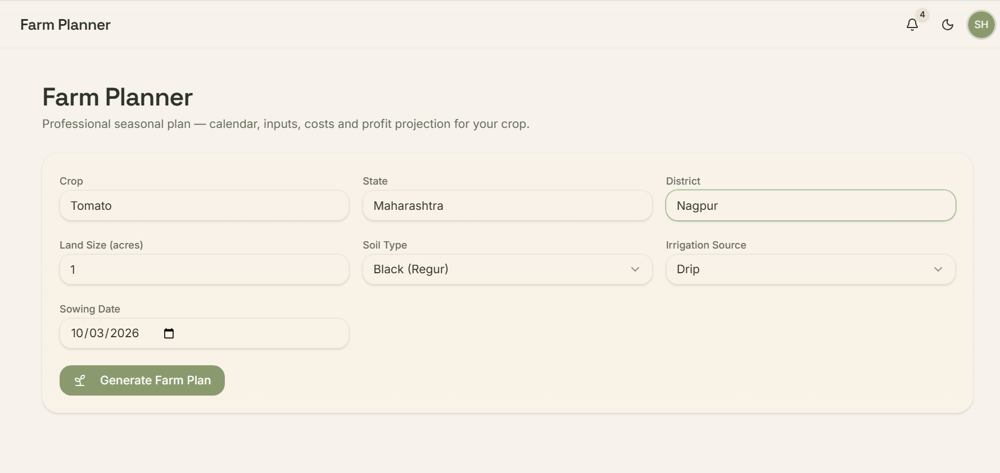
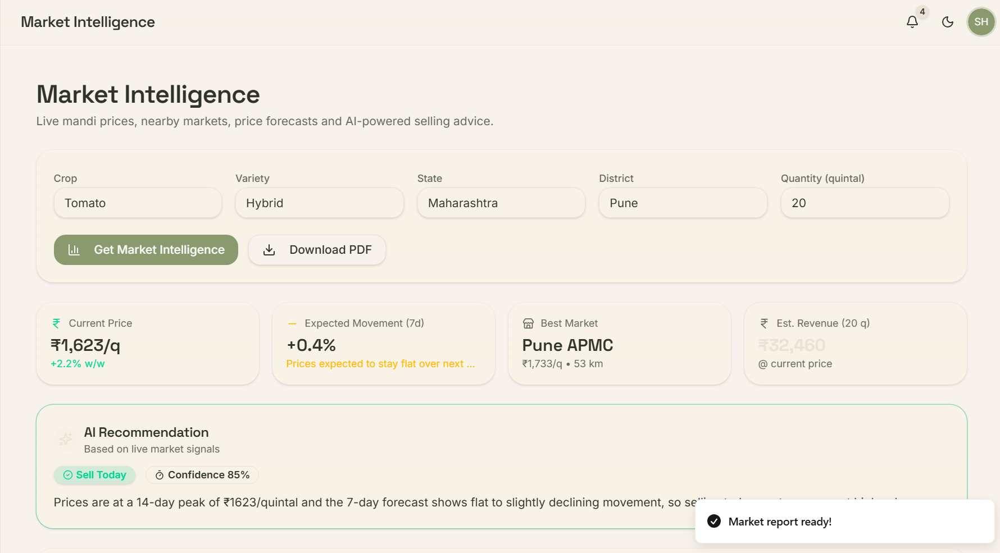
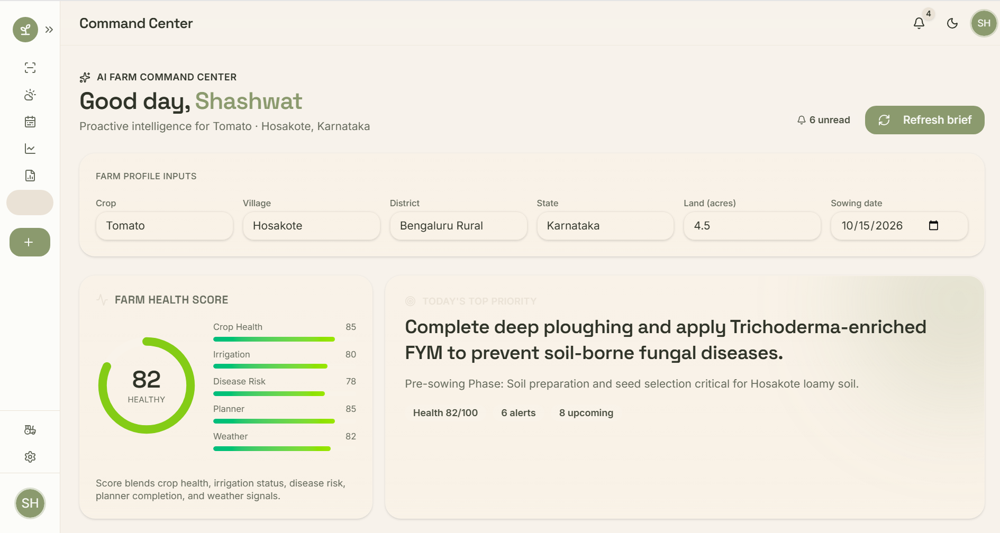
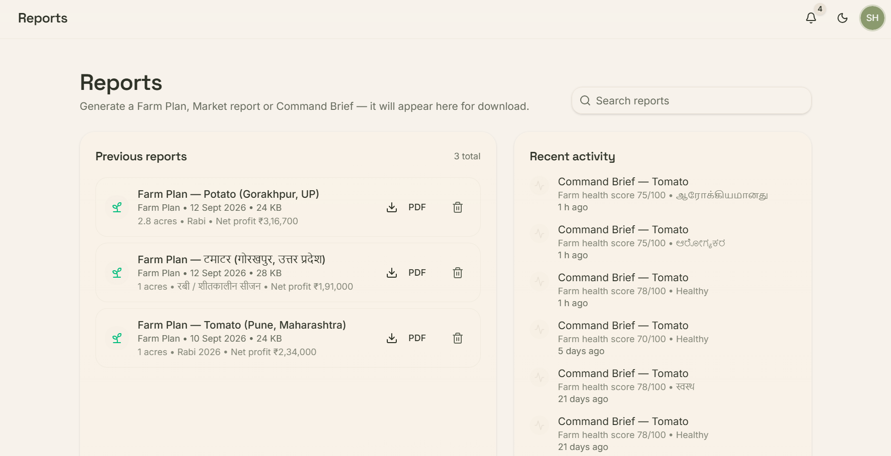

# AgriAssist AI

> AI-powered agriculture platform for crop guidance, disease detection, weather intelligence, farm planning, market insights, and multilingual farmer assistance.

**🌐 Live Demo:** https://agriassist-ai.codedomain.workers.dev

**📸 Application Screenshots**

| Dashboard | AI Chat |
|---|---|
|  |  |

| Disease Scanner | Weather |
|---|---|
|  |  |

| Farm Planner | Market Intelligence |
|---|---|
|  |  |

| Command Center | Reports |
|---|---|
|  |  |


AgriAssist AI is an AI-assisted agriculture platform designed for Indian farmers. It brings crop guidance, disease analysis, weather intelligence, farm planning, market intelligence, alerts, reports, and farmer-profile management into a single web application.

The application is built as a full-stack React/TypeScript application using TanStack Start/Router, Supabase, Cloudflare Workers/Nitro, WeatherAPI, and Google Gemini accessed through Cloudflare AI Gateway.

## Features

### AI Chat
A multilingual agricultural assistant that can handle farmer questions and route requests to specialized AI agents.

Supported areas include:

- General agricultural assistance
- Crop disease guidance
- Weather and irrigation advice
- Mandi/market guidance
- Government-scheme information
- Fertilizer and irrigation guidance

The AI supports:

- English
- Hindi
- Kannada
- Tamil

## Disease Scanner

The Disease Scanner supports crop/leaf image input and sends image data to Gemini for AI-assisted analysis.

The disease workflow can return information such as:

- Likely disease/pest
- Severity
- Confidence
- Emergency level
- Explanation
- Treatment/recommendation blocks

Disease scan results can be saved and retrieved for the authenticated farmer.

### Weather Intelligence

Weather data is retrieved from WeatherAPI.

The weather module provides:

- Current conditions
- Hourly forecast
- Multi-day forecast
- Temperature and feels-like temperature
- Humidity
- Wind
- Rain probability
- Precipitation
- UV index
- Weather condition information
- Crop-aware irrigation advice
- Spray-safety advice
- Disease-risk assessment
- Pest-risk assessment
- Heat-stress warnings
- Frost warnings
- Today/tomorrow activity recommendations

The application also supports Indian PIN-code lookup for deriving location information.

### Farm Planner

The Farm Planner generates a seasonal crop plan using:

- Crop
- State
- District
- Land size
- Soil type
- Irrigation source
- Sowing date
- Selected language

The generated plan can include:

- Seasonal calendar
- Irrigation schedule
- Fertilizer schedule
- Pest-management schedule
- Disease-management schedule
- Harvest window
- Costs
- Yield and profit estimates
- Practical farming tips

### Market Intelligence

Market Intelligence generates crop-specific market guidance using structured market data and Gemini.

The module supports:

- Current price representation
- Nearby market information
- Price trends
- Forecast data
- Expected price movement
- Market-selection guidance
- Transportation considerations
- Expected profit estimation
- Risk factors
- Farmer-friendly multilingual advisory

The market module explicitly treats generated market values as estimates when exact live information is unavailable.

### Command Center

The Command Center provides a centralized view of farmer alerts and operational information.

Command Center state is persisted locally using application storage keys under the `agriassist.*` namespace.

### Reports

Reports can be generated and saved for supported report types, including:

- Farm plans
- Market intelligence
- Command center information
- Weather
- Disease scans
- General reports

Generated PDF data can be stored with authenticated user reports and retrieved later.

### Farm Profile

The farm profile stores farmer and farm information such as:

- Farmer name
- Contact information
- Preferred language
- Farm name
- Village/district/state/country
- Farm size
- Primary and secondary crops
- Soil type
- Water source
- Location coordinates

### Authentication

The application uses Supabase Authentication and authenticated server functions.

User-owned resources are protected with Supabase Row Level Security policies.

### Multilingual Interface

AgriAssist AI supports:

| Code | Language |
|---|---|
| `en` | English |
| `hi` | Hindi |
| `kn` | Kannada |
| `ta` | Tamil |

AI agents also receive an explicit language instruction so natural-language responses are generated in the farmer's selected language.

---

## System Architecture

```text
                         ┌──────────────────────┐
                         │      Farmer/User     │
                         └──────────┬───────────┘
                                    │
                                    ▼
                         ┌──────────────────────┐
                         │ React + TanStack UI  │
                         │ TypeScript + Tailwind│
                         └──────────┬───────────┘
                                    │
                                    ▼
                       ┌────────────────────────┐
                       │ TanStack Start Server  │
                       │ Server Functions       │
                       └───────┬────────┬───────┘
                               │        │
                 ┌─────────────┘        └──────────────┐
                 ▼                                      ▼
       ┌──────────────────┐                    ┌──────────────────┐
       │     Supabase     │                    │ External APIs    │
       │ Auth + PostgreSQL│                    │ WeatherAPI       │
       └──────────────────┘                    │ PIN lookup       │
                                                └────────┬─────────┘
                                                         │
                                                         ▼
                                              ┌─────────────────────┐
                                              │ Cloudflare AI Gateway│
                                              └─────────┬───────────┘
                                                        │
                                                        ▼
                                              ┌─────────────────────┐
                                              │ Google Gemini       │
                                              │ AI model            │
                                              └─────────────────────┘
```

### AI Request Flow

```text
Farmer message/image
        │
        ▼
TanStack Start server function
        │
        ▼
Intent / specialized agent
        │
        ▼
Gemini helper
        │
        ▼
Cloudflare AI Gateway
        │
        ▼
Google AI Studio / Gemini
        │
        ▼
Structured AI response
        │
        ▼
AgriAssist UI
```

The Gemini API key is not exposed directly to browser requests. The application uses a server-side Cloudflare AI Gateway token, while the Google provider key is stored in the Cloudflare AI Gateway configuration.

---

## Technology Stack

### Frontend

- React 19
- TypeScript
- TanStack Router
- TanStack Start
- TanStack React Query
- Tailwind CSS
- Radix UI
- Framer Motion
- Lucide React
- Recharts
- React Markdown
- Remark GFM

### Backend / Application Server

- TanStack Start server functions
- Nitro
- Cloudflare Workers deployment

### AI

- Google Gemini
- Cloudflare AI Gateway
- Specialized AgriAssist AI agents
- Image input for disease analysis
- JSON-mode AI workflows for structured outputs

### Database and Authentication

- Supabase
- PostgreSQL
- Supabase Authentication
- Row Level Security
- Server-side Supabase access

### External Services

- WeatherAPI for weather and forecast data
- Indian PIN-code API for PIN-based location lookup

### PDF / Reporting

- jsPDF

---

## AI Agent Architecture

The application contains specialized server-side agents:

```text
Intent Router
     │
     ├── General Agent
     ├── Disease Agent
     ├── Weather Agent
     ├── Market Agent
     ├── Government Agent
     └── Fertilizer Agent
```

Each specialized agent has a dedicated system prompt and receives the farmer's selected language.

The Disease Agent can receive image data. The Weather, Market, and Farm Planner workflows use structured JSON schemas to make the AI output easier for the application to process.

---

## Project Structure

```text
agriassist-ai/
├── public/
│   └── favicon.png
│
├── src/
│   ├── assets/
│   │   └── hero-farm.jpg
│   │
│   ├── components/
│   │   ├── agriassist/
│   │   └── ui/
│   │
│   ├── context/
│   │   └── LanguageContext.tsx
│   │
│   ├── hooks/
│   │   └── useFarmer.ts
│   │
│   ├── integrations/
│   │   └── supabase/
│   │
│   ├── lib/
│   │   ├── account/
│   │   ├── agents/
│   │   ├── ai/
│   │   ├── chat/
│   │   ├── command-center/
│   │   ├── farm-planner/
│   │   ├── market/
│   │   ├── reports/
│   │   └── weather/
│   │
│   ├── routes/
│   │   ├── login.tsx
│   │   ├── register.tsx
│   │   ├── forgot-password.tsx
│   │   ├── reset-password.tsx
│   │   ├── auth.callback.tsx
│   │   ├── _workspace.dashboard.tsx
│   │   ├── _workspace.chat.tsx
│   │   ├── _workspace.command-center.tsx
│   │   ├── _workspace.disease-scanner.tsx
│   │   ├── _workspace.farm-planner.tsx
│   │   ├── _workspace.farm-profile.tsx
│   │   ├── _workspace.market-intelligence.tsx
│   │   ├── _workspace.reports.tsx
│   │   ├── _workspace.settings.tsx
│   │   └── _workspace.weather.tsx
│   │
│   ├── router.tsx
│   ├── server.ts
│   ├── start.ts
│   └── styles.css
│
├── supabase/
│   ├── config.toml
│   └── migrations/
│
├── .env.example
├── .gitignore
├── LICENSE
├── package.json
├── package-lock.json
└── wrangler.jsonc
```

---

## Database

The supplied Supabase migration defines the following core tables:

### `profiles`

Stores authenticated farmer profile information, including:

- Name
- Email
- Phone
- Avatar
- Preferred language
- Timestamps

### `user_roles`

Stores application roles such as:

- `farmer`
- `admin`

### `farms`

Stores farm information including:

- Farm name
- Location
- Farm size
- Primary/secondary crops
- Soil type
- Water source
- Latitude/longitude

### `chat_history`

Stores conversations belonging to authenticated users.

### `chat_messages`

Stores individual user, assistant, and system messages.

### `reports`

Stores saved reports and report metadata.

Row Level Security policies restrict user-owned data to the authenticated owner where defined by the migration.

---

## Environment Variables

Create a local `.env` file from `.env.example`.

```env
VITE_SUPABASE_URL=https://your-project.supabase.co
VITE_SUPABASE_PUBLISHABLE_KEY=your-publishable-key

SUPABASE_URL=https://your-project.supabase.co
SUPABASE_PUBLISHABLE_KEY=your-publishable-key
SUPABASE_SERVICE_ROLE_KEY=your-service-role-key

CF_AIG_TOKEN=your-cloudflare-ai-gateway-token

WEATHERAPI_KEY=your-weatherapi-key
```

### Secret handling

Never commit `.env`.

The following values are server-only and must not be exposed to the client:

- `SUPABASE_SERVICE_ROLE_KEY`
- `CF_AIG_TOKEN`
- `WEATHERAPI_KEY`

The Google Gemini provider key is configured through Cloudflare AI Gateway rather than being placed directly in the application's client code.

---

## Local Development

### Prerequisites

Install:

- Node.js
- npm
- A Supabase project
- A Cloudflare AI Gateway configuration
- A WeatherAPI key

### Install dependencies

```bash
npm install
```

### Configure environment variables

```bash
copy .env.example .env
```

Then fill in the required values.

### Start development server

```bash
npm run dev
```

### Build the application

```bash
npm run build
```

### Preview the production build

```bash
npm run preview
```

---

## Production Deployment

The application is configured for Nitro/Cloudflare deployment.

Build:

```bash
npm run build
```

Deploy the generated prebuilt application:

```bash
npx nitro deploy --prebuilt
```

The Cloudflare Worker configuration is defined in:

```text
wrangler.jsonc
```

---

## Security

AgriAssist AI uses several security measures:

- Supabase Authentication
- Supabase Row Level Security
- Authenticated server functions
- Server-side service-role database access
- Server-only API tokens
- Cloudflare AI Gateway for Gemini access
- User ownership checks before reading/updating/deleting user data
- `.env` excluded from version control

The browser should never receive the Supabase service-role key, Cloudflare AI Gateway token, or WeatherAPI server key.

---

## AI and Data Considerations

AI-generated agricultural recommendations should be treated as decision-support information rather than a substitute for qualified agricultural professionals or official local advisories.

For market intelligence and planning workflows, the application distinguishes estimates from live information where live information is not available.

For government-scheme information, users should verify current eligibility, benefits, and application procedures with the relevant official government source.

For pesticide, fertilizer, and disease-management recommendations, users should follow the product label, local agricultural guidance, and applicable safety requirements.

---

## Supported Application Modules

| Module | Purpose |
|---|---|
| Dashboard | Central farmer workspace and overview |
| AI Chat | Multilingual agricultural assistant |
| Disease Scanner | AI-assisted crop/leaf disease analysis |
| Weather | Weather data and crop-aware advisory |
| Farm Planner | Seasonal crop planning |
| Market Intelligence | Market trends and selling guidance |
| Command Center | Farmer alerts and operational information |
| Reports | Saved agricultural reports |
| Farm Profile | Farmer and farm information |
| Settings | Application preferences and configuration |

---

## License

AgriAssist AI is released under the MIT License.

See [`LICENSE`](./LICENSE) for the complete license text.

---

## Project Status:

AgriAssist AI currently provides a working full-stack agriculture workspace with:

- Multilingual AI assistance
- AI-powered image analysis
- Weather intelligence
- Seasonal farm planning
- Market intelligence
- Farmer alerts
- Report generation/storage
- Supabase authentication and data persistence
- Cloudflare Workers/Nitro deployment
